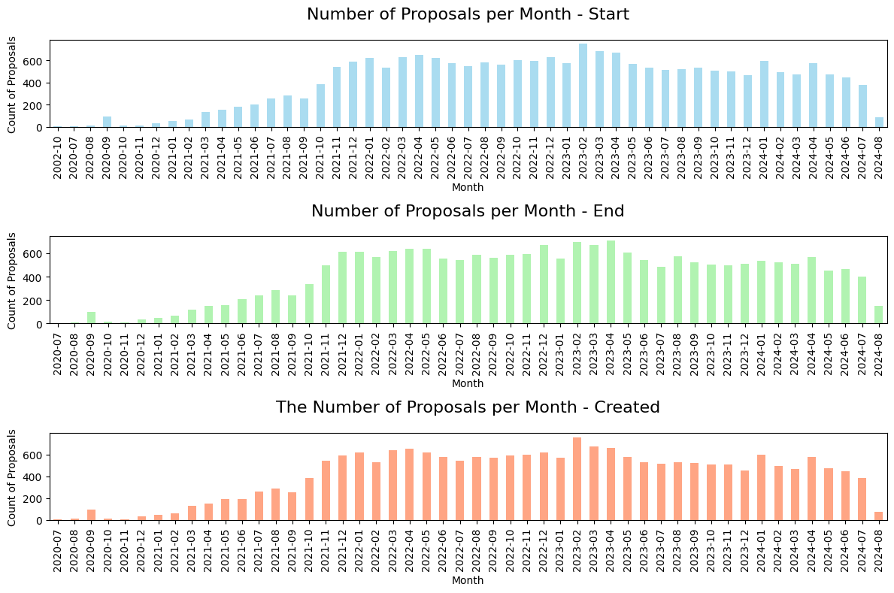

<style scoped>
section { background: #b5c1d4}
</style>

# The Comprehensive Analysis of Proposal in DAOs

---

<!-- paginate: true -->

# Motivation

- Analyze functions of DAO proposal by categorization and clustering
- Inspect effect of each functions to TVL or token price

#

- Key Paper: Decentralized Governance and Digital Asset Prices (Ian Appel, Jillian Grennan, 2023)

---

## 1. What we have done

1. Proposal Dataset [Limit]: Web scraping of spaces and proposals
2. Proposal Dataset [Cleansing & Description]
3. Category: Constructing category of proposal
4. Labeling: Category of proposal dataset

## 2. What we will do

1.  Labeling category using LLM
2.  Robust Check
3.  Further Research

---

<style scoped>
  section { background: #b5c1d4 }
</style>

# 1-1. Proposal Dataset [Limit]

---

### 1-1. Proposal Dataset [Limit]

- Limit spaces
  - over 20 proposals
  - over 20 followers
  - over 0.1 percentile of vote counts
  - must have the proposal started in 2024
- Limit Proposals
  - remove when it has ..
    - duplicated content in title and body
    - empty content in title and body
    - body content length under 150
    - votes under 10

---

<style scoped>
  section { background: #b5c1d4 }
</style>

# 1-2-1. Proposal Dataset [Cleansing]

---

### 1-2-1. Proposal Dataset [Cleansing]

- Remove useless things
  - email
  - url: http, ipfs, image link (+ description)
  - wallet address
  - empty parentheses
- Remain validate content
  - eliminate when content is not written in English: https://pypi.org/project/langdetect/
  - regular expression pattern: [a-zA-Z0-9!@#$%^&*()_\-+{}\[\]:;≥"\'<>,.?/\\|`~\s]
- Remove useless footer/sentence in each protocol
  - by counting every paragraphs(splited by `#`) and scrutinizing uselessness
  - ex1) `This proposal appears on [Balancer's forum](`
  - ex2) `Please review the on-chain vote of the proposal in the link below:`

---

### 1-2-1. Proposal Dataset [Cleansing]

- Remove resubmitted proposal: 163
  - Levenshtein edit distance (string)

<div style="display:flex; justify-content:space-around;">


</div>

---

### 1-2-1. Proposal Dataset [Cleansing]

- Remove resubmitted proposal: 163
  - Levenshtein edit distance (string)
    - Set lower case in all the content
    - Sort by lexicographical order on the content
    - $\text{distance} = \cfrac{\text{Levenshtein distance}}{\max (\text{Length of prev content }, \text{Length of next content})}$
    - Condition
      - grouped by space
      - created less than 5 days apart
      - identical title: $\text{String distance} = 0$
      - very similar body: $\text{String distance} < 0.5$
    - Remove previous proposal

---

### 1-2-1. Proposal Dataset [Cleansing]

- Remove resubmitted proposal: 163

  - Levenshtein edit distance (string)
    - etc
      - If title has 'resubmit', remove original one

---

<style scoped>
  section { background: #b5c1d4 }
</style>

# 1-2-2. Proposal Dataset [Description]

---

### 1-2-2. Proposal Dataset [Description]

- Description of Dataset
  - 245 spaces
  - 20750 proposals
  - 3049 authors
  - proposals from 2020-07

---



---

### 1-2-2. Proposal Dataset [Description]

<div style="display:flex; justify-content:space-between">
<div>

- Unit: Hour

- Remove the top and bottom 5%

</div>

| Duration of Proposal | Statistic  |
| -------------------- | ---------- |
| Count                | 18195      |
| Mean                 | 112.778851 |
| Std                  | 52.563157  |
| Min                  | 37.498611  |
| 25%                  | 72         |
| 50%                  | 96         |
| 75%                  | 167.960694 |
| Max                  | 335.995833 |

</div>

---


---

### 1-2-2. Proposal Dataset [Description]

<div style="display:flex; justify-content:space-between">
<div>

- Spaces under 5 proposals: 21

- Spaces under 10 proposals: 28

</div>

| Proposal Count per Space | Statistic |
| ------------------------ | --------- |
| Count                    | 245       |
| Mean                     | 84.69     |
| Std                      | 194.12    |
| Min                      | 1         |
| 25%                      | 22        |
| 50%                      | 38        |
| 75%                      | 78        |
| Max                      | 2301      |

</div>

---

### 1-2-2. Proposal Dataset [Description]

<div style="display:flex; justify-content:space-between">

<div>

- Top 7 (sorted by vote count):

  - `stgdao.eth`: 17795924
  - `arbitrumfoundation.eth`: 5289055
  - `aave.eth`: 3103339
  - `cakevote.eth`: 431105
  - `aavegotchi.eth`: 396567
  - `gmx.eth`: 305324
  - `uniswapgovernance.eth`: 275334

- Table was divided by 100 due to large number

</div>

| Vote Count per Space | Statistic  |
| -------------------- | ---------- |
| Count                | 2.45       |
| Mean                 | 1262.5953  |
| Std                  | 11997.8151 |
| Min                  | 0.12       |
| 25%                  | 8.36       |
| 50%                  | 27.1       |
| 75%                  | 110.72     |
| Max                  | 177959.24  |

</div>

---


---

<style scoped>
  section { background: #b5c1d4 }
</style>

# 1-3. Category

- Business VS Tokenomics VS Governance 3차원 variable로

  - 애매할 수록 ChatGPT도 답을 이상하게 내놓음 :(
  - Tokenomcis: + Reserve/Treasury
  - Busienss: + Operations
    - 사용자 후기/관심 체크용으로 사용하는 건 어떡하지? -> Survey ???
    - User Expansion + New Business Proposal + Expansion -> Strategy or Expansion ???
      - 특정 protocol에서 "New"인지 알아보는 것도 쉽지 않고...

- Security는 퉁쳐서 Operations Feature Improvement 아래로 넣자

---

<style scoped>
  section { background: #b5c1d4 }
</style>

# 1-3. Category

- False
  - Category 추가: 게임 관련 이야기 -> Info/Announcement로 뺄까도 고민됨
    - Remove the location, 어떤 캐릭터 옷입히기
    - ban or confirm the user: 직원, 이사진 사퇴와 혼동 주의
  - 내가 잘 이해했는지 확인하는 글 -> Off-topic

---

### 1-3. Category

> sample_category.xlsx
> vote.vitadao.eth title

- 🧑‍💼 Business: `Fee`, `Expansion`, `User Expansion Strategy`, `New Business Proposal`, `Reward Adjustment`, `Rate`
- ⚙️ Operations: `Team`, `Liquidity Management`, `User Friendly Features`, `Risk Management`, `Feature improvement`, `Security`
- ⚖️ Governance: `Feature Improvement`, `Inclusive`, `Restrictive`, `Adjust`
- 🪙 Reserve/Treasury: `Grant`, `Donation`, `Asset Management`, `Token Sale`, `Reduce/Increase Reserve/Treasury`, `Steward`, `Request Grant`
- 💸 Tokenomics: `Grant for Incentive`, `Token Reward Adjustment`, `Adjust Supply`, `Token Allocation`
- 🙃 FALSE: `Request Money`, `Not Detailed`, `Off-topic`, `Info/Announcement`

---

### 1-3-1. Category [🧑‍💼 Business] - Title & Choice Sample

Expansion: `Add new token`

- Add gmBTC on Arbitrum V3: `['YAE', 'NO', 'Abstain']`
- Enable Metis as Collateral on Metis Chain: `['YAE', 'NAY', 'ABSTAIN']`
- List $PEPE: `['✅List $PEPE🐸', '❌Don’t List $PEPE🐸']`
- Rich Token Liquidity Pool: `['Yes, I will buy some Rich right now', 'No']`
- Proposal for a Pandora ($PANDORA) Farm on Ethereum: `['✅ We want a PANDORA-WETH Farm on Ethereum!', '❌ We don’t want a PANDORA-WETH Farm on Ethereum!']`

Expansion: `Collaboration with other networks`

- Deploy Aave V3 on Mode: `['YAE', 'NAY', 'ABSTAIN']`
- Proposal to Launch veCAKE on zkSync: `['✅ Yes, we want to launch veCAKE on zkSync!', "❌ No, we don't want to launch veCAKE on zkSync!"]`

---

### 1-3-1. Category [🧑‍💼 Business] - Title & Choice Sample

> (Fee decrease -> user expansion) OR (Rate -> Tokennomics risk management)로 볼 수 있지 않나
> Pool Fee = 거래소 수수료는 pool supplyer에게 줌 -> 내가 유동성 공급한 거래가 이뤄질 때마다 이득을 취하게 됨 -> 이자 받는 느낌이 됨. 그래서 APY 단위로 광고함.
> Fee 조절로 인한 거래 참여도에 영향x 일 수도.

Rate

- wMATIC Interest Rate Update: `['YAE-5.00%', 'YAE-4.30%', 'NAEY', 'ABSTAIN']`
- Change the fee in the BAT pool from 0.2% to 0.5%: `['For','Against', 'Abstain']`
  - 이건 진짜 Fee로 오해하기 쉽다ㅠㅠ
- Increase GHO Borrow Rate: `['YAE', 'NAY', 'ABSTAIN']`

---

### 1-3-1. Category [🧑‍💼 Business] - Title & Choice Sample

New Business Proposal

- Casino Proposal: `['Yes, casino would be good feature to implement in future', 'Perhaps, due to market uncertainty we could implement it. But now is not the best time', 'No, i would not like casino feature', 'Maybe. Casino sounds like interesting idea. ', "i like cakes :) (don't pick this one)"]`
- P2E Game Development: `['✅YES to P2E Games Development ', '❌ NO to P2E Game Development']`
- PancakeSwap DeFi Wallet Mobile: `['Create App', 'Disregard Idea']`

---

### 1-3-1. Category [🧑‍💼 Business] - Title & Choice Sample

> User Expansion Strategy & New Business Proposal 삭제하고 Expansion만 남기기
> 아니면 Strategy라는 이름으로 3개 다 한 번에 퉁치기

User Expansion Strategy: `New feature proposal`

- PancakeSwap Trading Bot Marketplace: `['Do it', 'No need']`
- PancakeSwap x Polygon zkEVM Campaign: `['I MINTED ✅', "I'm late"]`

User Expansion Strategy

- Add more LANDs to reduce market price: `['Yes', 'No', 'N/A', 'Invalid question/options']`
- Add more mainchain to reduce gas fee: `['YES', 'NO']` - 의도에 따라서...?
- PROPOSAL FOR A NFT LOTTERY: `['NICE IDEA', 'Shitty IDEA', 'Neutral']`

---

### 1-3-1. Category [🧑‍💼 Business] - Title & Choice Sample

> Opearation의 Liquidity Management와 Business Fee가 혼동

Fee: `Adjustment`

- Adjust Fees for Leverage on Trades to iLINK: `['sYES', 'iNO']`
- balFactor: incentivizing BAL liquidity on Balancer: `['Approve', 'Reject']`
- Increasing share of emissions going to ALCX holders: `['Yes.', 'No.']`
- Modifying feeFactor: toward reducing the mining penalty for high-fee pools: `['Approve', 'Reject']`

Fee

- Change fee of Governance NFT for 721DAO: `['Keep at 7.21%','10%','15%','5%']`
- Change the fee in the BAT pool from 0.2% to 0.5%: `['For', 'Against', 'Abstain']`

---

### 1-3-2. Category [⚙️ Operations] - Title & Choice Sample

> 더 많은 사례가 필요함...
> 개념 상으로 risk management랑 햇갈림

Liquidity Management: `LP to specific market`

- Allocate 500,000 LDO to seed LDO/ETH market on DeversiFi: `['YES - 500,000 LDO', 'YES - 250,000 LDO', 'NO']`

---

### 1-3-2. Category [⚙️ Operations] - Title & Choice Sample

> 어떤 기능을 추가하자고 하는데 이게 security와 관련된 것인지 알기가 애매했음
> "Do you trust the vouch from strangers?
> What if I don't want the vouch from a stranger?
> A use case for this is explained in this thread I made explaining a real life case: "

Security: `Privacy`

- Integration of Privacy Enhancing protocol for PancakeSwap: `['Approved', 'Rejected']`
- Anonymizing User's Position Information: `['yes', 'no', 'abstain']`
  - 익명화에 있어 '서비스'에 대한 것인지 '투표'에 대한 것인지에 따라 Gov or Ops

Security

- Business Reviews, Scam Prevention, Security Help & Registries [Trust In DCL]: `['yes', 'no']`
- moves on for further technical and infrastructural review: `['Approve', 'Deny']`

---

### 1-3-2. Category [⚙️ Operations] - Title & Choice Sample

> 이사진 선출이 Gov가 될 수도 있겠지만 그러면 너무 힘들어서 일단 다 Ops로 함
> Hiring(Election, Candidate) or Funding for Team(?)

Team: `Hiring`

- Hiring ctrl as COO: `['👍 For', '👎Against']`
- [Multi-sig Governance] Candidate (Contributor): `['I want this candidate to represent $SUSHI', '-']`
  - 익명화에 있어 '서비스'에 대한 것인지 '투표'에 대한 것인지에 따라 Gov or Ops
  - Multi sig는 어떤 곳에서 마스터 계정 주인 역할로, proposal 처리 권한도 갖게 됨.

User Friendly Features

- "Seaweed mode" (Dark mode) : `['Yes, Seaweed mode', 'No, Just a normal dark mode']`
- Add a "Search by Name" Booth or Machine: `['Yes', 'No']`

---

### 1-3-2. Category [⚙️ Operations] - Title & Choice Sample

Feature Improvement

> Operation의 Feature Improvement와 Business의 New business proposal OR Expansion가 혼동

- PancakeSwap Academy: `['Do it', 'No need']` ~ 메인 홈페이지 개설 관련
- Add Decentralized OTC function (AirCash): `['Add DOTC function (AirCash).', 'It is an useless function.', 'No comment but maybe can try.']`

> Operation의 Feature Improvement와 User Friendly Features 혼동
> Rename: User Friendly Features -> UI/UX ...

- Extend Name length: `['Extend Name length to 20 characters ', 'Keep name length 15 characters', 'Invalid question/options']`
- Can we Minimize the Website Performance Because it needs so much network to even load?: `['Yes', 'No', 'We Will See', 'Invalid question/options']`

---

### 1-3-2. Category [⚙️ Operations] - Title & Choice Sample

Risk Management

- LTV(Loan to Value Ratio), 풍차돌리기 담보금 조절

  - LTV=0 : 이걸 담보로 대출 불가능하게 하기

- [ARFC] Risk Parameters for DAI Update: `['Conservative', 'Aggressive', 'Abstain']`
- [ARFC] Recommendation to freeze and set LTV to 0 for BAL on Aave v3 Polygon: `['YAE', 'NAY', 'Abstain']`
  - Motivation: We recommend freezing and setting LTV to 0 for BAL on Aave v3 Polygon because it contributes minimally to the protocols reserve growth, compared to the risk it adds to the protocol.
  - Specification: Freeze and set LTV to 0 for BAL on Aave v3 Polygon.

---

### 1-3-3. Category [⚖️ Governance] - Title & Choice Sample

Inclusive: `Relaxation of voting participation requirements`

- The CAKE lock warehouse automatically exits the mechanism, listens to the CAKE HOLDER's opinions, and hopes the kitchen hears or sees our ideas: `['yes', 'no', 'Supported YES Unsupported NO']` -[Updated] Add Voting Power to Crowns and Scepters: `['Yes: add VP to Crowns/Scepters', 'No: Do NOT add VP to Items']`

Inclusive -> 기능 개선으로 가자... 물론 inclusive라고 이야기하지만 그 사람만의 이야기일 수도 있고...

- Add a button to reverse/cancel vote: `['None', 'None']`
- Allow to remove vote on DAO proposals: `['Agree', 'Disagree', 'Invalid question/options']`

Restrictive

- FIX CAKE SNAPSHOTS: `['Yes', 'No']` - threshold to join governance

---

### 1-3-3. Category [⚖️ Governance] - Title & Choice Sample

> Gov 용 Feature improvement 카테고리가 필요할까? feature improvement는 한데 모아서 가는게 나으려나?

Feature Improvement

- Add a 'insufficient VP' outcome for proposals: `['Yes', 'No']`
- Add Proposal Writing "Requirements": `['Yes', 'No']` -> 의안 템플릿 수정이면 정관 변경일까?

Adjust `adjust와 inclusive 차이?`

- Proposal to migrate vCAKE to veCAKE: `['✅ Yes, migrate vCAKE to veCAKE!', '❌ No, do not migrate vCAKE to veCAKE!']`
  - We propose to migrate PancakeSwaps voting rights from vCAKE to veCAKE. If this proposal passes, veCAKE will become the measurement of a users voting power in PancakeSwaps governance system.

---

### 1-3-4. Category [🪙 Reserve/Treasury] - Title & Choice Sample

Asset Management

- Funding Update: `['YAE', 'NAY', 'ABSTAIN']`

  - proposes consolidating DAO assets in preparation of foreseeable DAO expenses. There are additional small treasury management actions included in this proposal for house-keeping.
  - 흩어진 자산(aEthlUSD, awBTC..)들이 한순간에 0원 되기 전에 모아서 우리 stablecoin으로 바꿔두겠다
  - Risk Management의 주체가 명확히 나오지 않았기에 아님

- Create an Aave Financial Management Working Group: `['YAE', 'NAY', 'ABSTAIN']`
  - This proposal aims to establish a FMWG at Aave DAO with the goal of enhancing financial reporting and auditing, GHO stablecoin management, treasury management as well as Safety Module management.

---

### 1-3-4. Category [🪙 Reserve/Treasury] - Title & Choice Sample

Donation: `Charity`

- AIP-96: Funding for Public Goods (ETHGlobal & Gitcoin) - Ecosystem Fund Allocation: `['In favor', 'Against']`

Reduce/Increase

- [ARFC] Reduce Reserve Factor on wstETH: `['YAE', 'NAY', 'ABSTAIN']`

---

### 1-3-4. Category [🪙 Reserve/Treasury] - Title & Choice Sample

Grant: `Ecosystem fund`

- First batch of grants from Balancer Ecosystem Fund: `['Approve', 'Reject']`
  - A 100k BAL first batch of grants to be allocated by Balancer Labs to many teams/projects that are building on / contributing to Balancer.

Grant: `Requesting Grant`

- Growth fund for the team: `['200k SUSHI', '150k SUSHI', '100k SUSHI', '50k SUSHI', '25k SUSHI', '0k SUSHI', "I don't like this proposal"]`
  - Many volunteers are making expenses (server cost, contract deployment, online tool), we should reimburse them. Also we could move faster if the team had a discretionary monthly budget, a Growth fund.
- Aave Events & Sponsorship Grant 2024: `['YAE', 'NAY', 'ABSTAIN']`
  - This proposal includes participation in key ecosystem initiatives at EthCC and Devcon among other events.

---

### 1-3-4. Category [🪙 Reserve/Treasury] - Title & Choice Sample

> steward ownership와 다른 것 같은데?

Steward ????? - 소규모 프로젝트 운영 및 운영을 위한 자금 조달 관련 내용?

- Aave Finance Steward: `['YAE', 'NAY', 'ABSTAIN']`

Token Sale

- 특정 팀이 보유한 자금 또는 protocol's treasury를 시장에 내다 팜 (헤지펀드 회사처럼?)
- Liquidity Management랑 혼동된다 :(

- Treasury Diversification through Strategic Partnerships: `['Accept', 'Reject']`
  - If passed, this proposal would transfer 538,461 POOL tokens (5.38% of total supply. and 9.4% of current treasury) from the treasury to ParaFi, Galaxy Digital, Dragonfly Capital, and Nascent. In exchange these parties will transfer $7 million to the protocol treasury

---

### 1-3-5. Category [💸 Tokenomics] - Title & Choice Sample

> MAX supply는 양적완화처럼 관련하여 통화가치 조정하는 느낌

Adjust Supply: `Decrease`

- CAKE Inflation: `['I agree with you.', 'No.']`
  - == 자사주매입 소각 요청
- Chance max supply: `['Yes, do something', 'Yes, do it right nooooww']`

Token Allocation: `To managers`

- Proposal for CAKE allocation to Position Managers: `['✅ Yes, allocate CAKE rewards for Position Managers!', '❌ No, do not allocate CAKE rewards for Position Managers!']`

---

### 1-3-5. Category [💸 Tokenomics] - Title & Choice Sample

Grant: `Incentive`

- Incentivize minting jFiat - 1/3: `['10% (APY 20%)', '20% (APY 40%)', '30% (APY 60%)', '40% (APY 80%)', '50% (APY 100%)']`

---

### 1-3-5. Category [💸 Tokenomics] - Title & Choice Sample

Token Reward Adjustment: `Increase`

- Auto-compound on veCake benefits: `['Introduce auto-compound functionality to the veCake staking pool.', 'I am fine without introducing auto-compound.']`
- Cake POOL Stacking APR%: `['Increase Cake Pools stacking APR %', 'Leave it as it is']`
- Locked Cake holders should receive compensation: `['Receive % of locked tokens', 'Receive Exclusive NFT', 'Cake Held hostage with no compensation ']`
- Proposal for CAKE Rewards on Bril Finances Vaults: `['✅ We want CAKE Rewards on Bril Finance’s Vaults!', '❌ We don’t want CAKE Rewards on Bril Finance’s Vaults!']`

---

Token Reward Adjustment: `Lower`

- Proposal for Adjustments to Farm Rewards: `['✅ Yes, make the adjustments!', "❌ No, don't make the adjustments!"]`
- Signaling proposal to reduce emission towards Staking: `['Yes, Reduce emissions towards Staking and Burn them.', "No. Don't reduce emissions towards Staking."]`

Token Reward Adjustment: `Adjust`

- Proposal for Emissions Redirection for v3 Products: `['✅ – Yes, redirect emissions!', '❌ – No, do not redirect emissions!']`
- Proposal to Direct CAKE Emissions to Locker Protocols: `['✅ Yes, we want to improve incentive efficiency and redirect CAKE!', '❌ No, we don’t want to improve incentive efficiency and redirect CAKE!']`

---

> Tokenomics VS Reserve/Treasury VS ... Business???

- CAKE BARROW FUND: propose a fund where users can 'stake' there CAKE to be able to borrow USDC at 1% APR. Once the fund reaches $7.5 USDC, it will be open to use and user will be able to borrow .01 USDC per Cake staked in the fund. Allowing, CAKE holders to borrow at a rate which is lower than ANY other lending/borrow service.

---

<style scoped>
  section { background: #b5c1d4 }
</style>

# 1-4. Labeling

---

### 1-4. Labeling

- Cosine Similarity (with TF-IDF vectorization) to find similar proposal body
  - TF-IDF: **Term** Frequency & Inverse **Document** Frequency


---


---


---


---

- the value between 0(different) ~ 1(similar)
  

---

### 1-4. Labeling

- Preprocessing
  - Set lower case
  - Remain only english
  - Remove stopwords: `the, a, I, my, me, is, ...`
  - Remove words appeard under three times
    - Unless the word is not in dictionary
    - Bag of words(BoW): Just counting every words in body content on whole dataset
  - Lemmatization: singularize & past -> original

---

### 1-4. Labeling

- Result of cosine Similarity


---

<style scoped>
  section { background: #b5c1d4 }
</style>

# 2. Next step

---

### 2. Next step

1. Labeling category using LLM(ChatGPT4o-mini)

2. Robust Check

- Validating meaningful categorization
- Check the effect on TVL or price
  - Test hypothesis statistically

3. Further Research

- Sincerity measure
  - Count Typos
- Unsupervised Learning
  - Topic modeling -> extract keywords

---

<style scoped>
  section { background: #b5c1d4 }
</style>

# Appendix

1. Proposal Sample

---

##### Proposal Sample

```
id 0x89f4f8ea61c728fbb6e60fc97826fd955dbeb9e3e7d6...
end 2023-06-27 20:46:00
app snapshot
ipfs bafkreidwgmggjxoxvlzhzy6fgxnzx3doxwifb3x6yzoug...
type single-choice
body Summary:\nThe proposal is to remove the old sd...
link https://snapshot.org/#/stakedao.eth/proposal/0...
title #SDGP 16 - Remove old sdTKN/TKN curve gauges f...
start 2023-06-22 20:46:51
state closed
votes 22
author 0x41717436744232Fb66E85fFAf388a8a33BC7397a
symbol veSDT
scores [2233745.925800096, 0, 0]
created 2023-06-22 20:47:52
updated NaN
network 1
choices ['Yes, remove it', 'No, don’t remove it', 'Abs...
flagged False
strategies [{'network': '1', 'params': {'symbol': 'veSDT'...
discussion NaN
scores_total 2233745.9258
scores_updated 1687866372
scores_by_strategy [[2233745.925800096], [0], [0]]
space_id stakedao.eth
```
